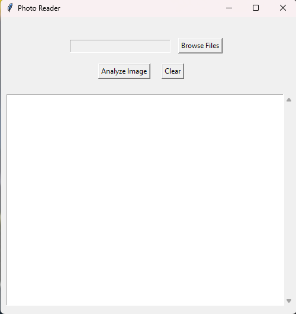

# PhotoReader

### This application gives the user the ability to read and process the text from images easily.

---

****

#### **Figure 1: UI Screenshot.**

---

# Instructions:

**1: Download the latest release from the right side.**

**2: Click on the PhotoReader.exe file.**

**3: To load an image, click the "Browse Files" option and select a file.**

**4: To analyze the image and get the text, click the "Analyze Image" button.***

**5: To clear the UI screen: press the "Clear" button.** 

---

# Notes:
#### ***Results may vary or be inaccurate.**